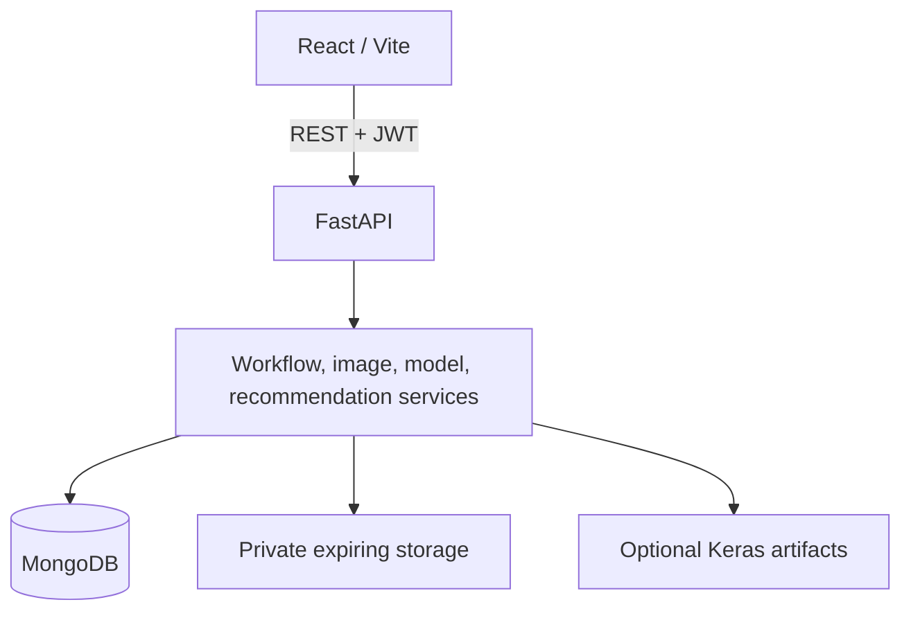

# DermaScan AI

DermaScan AI is a full-stack college mini-project that combines a self-reported
skin profile, consented temporary facial-image processing, technical quality and
face checks, optional AI-assisted visible estimates, safety-first catalogue
filtering, explainable product ranking, a morning/night routine, versioned final
reports, PDF export, and privacy-controlled feedback.

It is general skincare guidance, not a clinical system. The repository does not
contain trained model binaries or claim model accuracy.

## Main Features

- Registration, Argon2 password hashing, expiring JWT access tokens, session
  restoration, and protected routes.
- Owner-scoped questionnaire, upload, analysis, recommendation, report, and
  feedback records.
- JPG/PNG validation by extension, MIME, actual decoding, dimensions, file size,
  decompression protection, orientation normalization, and metadata removal.
- OpenCV technical image-quality checks and MediaPipe one-face validation.
- Reproducible preprocessing and strict exported-model input contracts.
- Conservative uncertainty for broad skin type and visible observations.
- Allergy, avoided-ingredient, age, sensitivity, budget, availability, freshness,
  and user-specific product-avoidance filtering.
- Explainable deterministic recommendation scoring and routine generation.
- Versioned report history, privacy-aware PDF export, and optional feedback.
- Request IDs, safe error responses, structured logging, readiness, cleanup,
  rate limiting, CI, Docker, and demonstration data.

## Workflow


Every private transition is revalidated by FastAPI. React route guards are user
experience controls, not the security boundary.

## Architecture



See [system architecture](documentation/system-architecture.md),
[API reference](documentation/api-reference.md), and
[database schema](documentation/database-schema.md).

## Technology Stack

- Frontend: React 18, Vite 6, JavaScript, Tailwind CSS, React Router, Axios,
  Lucide icons, Vitest, Testing Library, Playwright, ESLint.
- Backend: Python 3.12, FastAPI, Motor/MongoDB, Pydantic, PyJWT, pwdlib/Argon2,
  Pillow, NumPy, OpenCV, MediaPipe, TensorFlow/Keras, ReportLab.
- ML workspace: TensorFlow/Keras, NumPy, Pillow, PyYAML, Matplotlib, pytest.
- Operations: Docker Compose, unprivileged Nginx, GitHub Actions, Ruff, Black,
  mypy, pytest-cov, pip-audit, npm audit.

## Repository Structure

```text
dermascan-ai/
|-- .github/workflows/       CI and dependency audits
|-- backend/                 FastAPI, tests, catalogue data, scripts
|-- deployment/              Nginx and Compose environment example
|-- documentation/           Architecture, API, privacy, testing, guides
|-- frontend/                React application, unit and E2E tests
|-- ml/                      Training/evaluation workspace, no private dataset
|-- docker-compose.yml
|-- CONTRIBUTING.md
|-- PRIVACY.md
|-- SECURITY.md
`-- README.md
```

Generated dependencies, builds, coverage, virtual environments, `.env` files,
temporary storage, model binaries, raw datasets, PDFs, and database dumps are
excluded from version control.

## Local Setup

### 1. MongoDB

Run MongoDB locally at `mongodb://localhost:27017`, or use the MongoDB service in
Docker Compose. Never point tests at production data.

### 2. Backend

```bash
cd backend
python -m venv .venv
```

Windows PowerShell:

```powershell
.\.venv\Scripts\Activate.ps1
```

Windows Command Prompt:

```bat
.venv\Scripts\activate.bat
```

Unix-like systems:

```bash
source .venv/bin/activate
```

Then:

```bash
pip install -r requirements-dev.txt
```

Create `backend/.env` from `backend/.env.example`, replace the JWT secret, then:

```bash
python -m app.scripts.seed_demo_data
uvicorn app.main:app --reload
```

API: `http://localhost:8000/api/health`
OpenAPI: `http://localhost:8000/docs`

### 3. Frontend

```bash
cd frontend
npm ci
```

Create `frontend/.env`:

```env
VITE_API_BASE_URL=http://localhost:8000/api
```

Then:

```bash
npm run dev
```

Website: `http://localhost:5173`

## Environment Configuration

`backend/.env.example` documents application, MongoDB, JWT, CORS, logging,
rate-limit, upload, quality, face detection, preprocessing, model, threshold,
catalogue freshness, recommendation weight, PDF, and feedback settings.

Important deployment values:

```env
APP_ENV=production
MONGODB_URL=mongodb://...
MONGODB_DATABASE=dermascan_ai
JWT_SECRET_KEY=<random secret of at least 32 characters>
FRONTEND_ORIGIN=https://frontend.example
LOG_LEVEL=INFO
ENABLE_HSTS=true
AI_DEMO_MODE=false
```

Production/staging startup rejects a placeholder or short JWT secret, invalid
HTTP(S) origin, inconsistent image thresholds, and recommendation weights that
do not total 1.0. Secrets are never sent to Vite.

## Models And Demonstration Mode

Place exported model/metadata files under `backend/app/ml/models` according to
[AI models](documentation/ai-models.md). Without artifacts, model status is
unavailable and readiness is false.

For a classroom demonstration only:

```env
AI_DEMO_MODE=true
```

This enables deterministic mock output. The API, database reports, UI, final
report, and PDF context label it `Demonstration Mode`. It is not a trained model,
does not produce evaluation metrics, and is off by default.

Seed only fictional brands/products and controlled ingredient records:

```bash
cd backend
python -m app.scripts.seed_demo_data
```

The command is idempotent. No demo user, password, personal image, or real-brand
formulation is committed. See the [demo guide](documentation/demo-guide.md).

## Temporary Data Cleanup

Preview cleanup without changing data:

```bash
cd backend
python -m app.scripts.cleanup_expired_data --dry-run
```

Perform cleanup:

```bash
python -m app.scripts.cleanup_expired_data
```

Cleanup covers expired uploads, face crops, preprocessed images, and temporary
PDF exports under confined configured roots. Schedule the command externally for
continuous environments; startup cleanup alone is not a scheduler.

## Testing

Backend:

```bash
cd backend
ruff check app tests
black --check app tests
mypy
pytest --cov=app --cov-report=term-missing --cov-report=html
pip-audit -r requirements.txt
```

Frontend:

```bash
cd frontend
npm ci
npm run lint
npm run test:coverage
npm run build
npx playwright install chromium
npm run test:e2e
npm audit --audit-level=high
```

ML workspace:

```bash
cd ml
pytest
```

See [testing strategy](documentation/testing.md). Test results and performance
measurements are recorded only after execution in
`documentation/final-readiness-report.md`.

## Docker

Create a root `.env` from `deployment/.env.example`, replace the JWT secret, then:

```bash
docker compose build
docker compose up -d
docker compose ps
```

Open `http://localhost:5173`. The included containers use production builds,
non-root application users where practical, health checks, a private API proxy,
named MongoDB/temp-storage volumes, and no development reload. See the
[deployment guide](documentation/deployment.md).

## Privacy And Security

Facial files and PDF exports expire after 30 minutes by default. Final reports
contain no facial images. The frontend stores only the JWT in `localStorage` and
the public active upload ID in `sessionStorage`; it stores no password, facial
image, allergy list, or report in browser storage. See [PRIVACY.md](PRIVACY.md)
and [SECURITY.md](SECURITY.md) for controls and limitations.

## Known Limitations

- No trained model artifacts, licensed training dataset, or validated accuracy
  are included.
- No clinical validation, diagnosis, prescription, or suitability guarantee.
- Access tokens are in `localStorage` and cannot be revoked server-side.
- Rate limits/metrics are process-local; no Redis, Prometheus, or alerting.
- Local temporary storage is not suitable for autoscaled multi-host deployment.
- Report removal is archival; account erasure/data export are not implemented.
- Product data is fictional demonstration data and can become stale.
- The committed E2E suite covers the real application boundary; a full
  model-dependent browser workflow requires valid artifacts or explicit demo mode.
- No live deployment URL is claimed by this repository.

## Documentation

- [Project overview](documentation/project-overview.md)
- [System architecture](documentation/system-architecture.md)
- [API reference](documentation/api-reference.md)
- [Database schema](documentation/database-schema.md)
- [AI models](documentation/ai-models.md)
- [Testing](documentation/testing.md)
- [Deployment](documentation/deployment.md)
- [User guide](documentation/user-guide.md)
- [Demo guide](documentation/demo-guide.md)
- [Final readiness report](documentation/final-readiness-report.md)

## Final Safety Disclaimer

DermaScan AI provides general skincare guidance based on visible facial
characteristics and user-provided information. It is not a medical diagnostic
system, does not prescribe treatment, and does not replace advice from a
qualified dermatologist.

Users experiencing severe, painful, infected, persistent, rapidly changing, or
unusual skin concerns should seek advice from a qualified healthcare professional.
