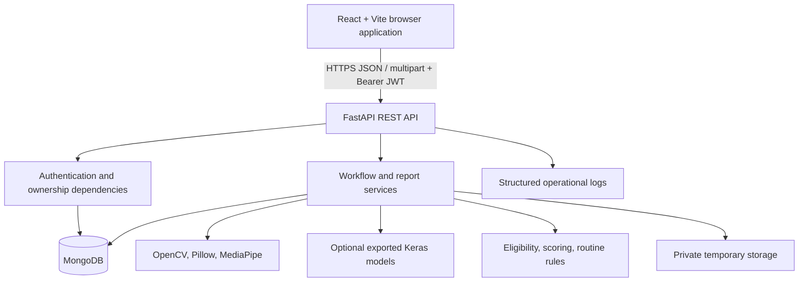
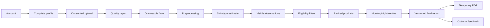
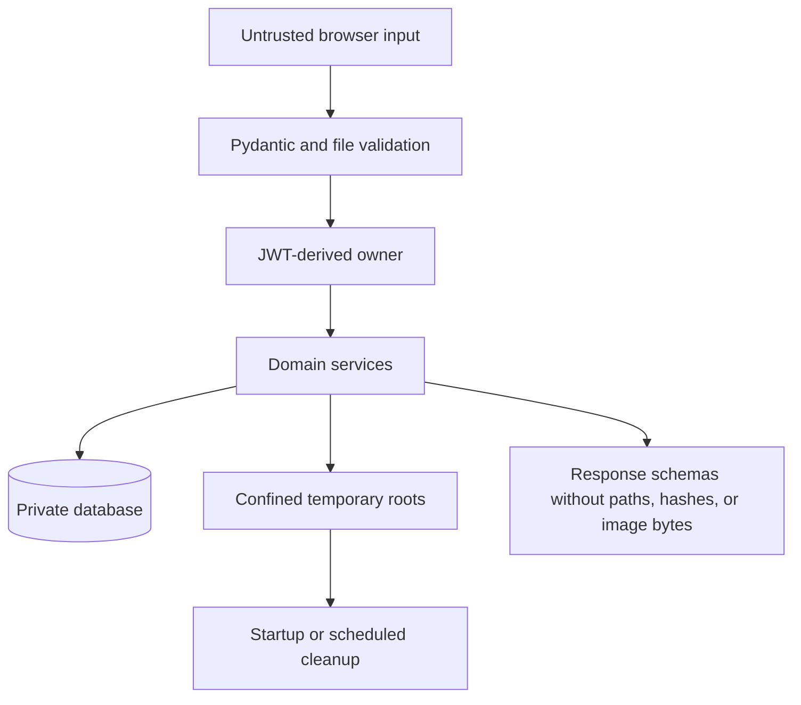
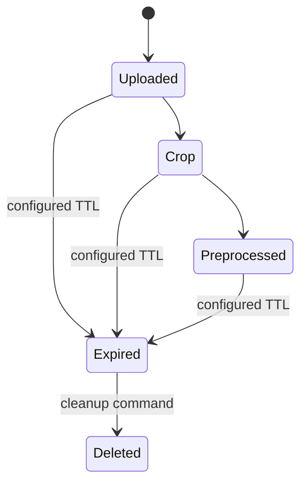

# System Architecture

## Component View

The browser never receives physical storage paths. MongoDB owns workflow
metadata; private local storage owns temporary image and PDF bytes. Model
registries load each configured model once per API worker.

## Workflow

Backend services enforce every transition by owner ID, upload status, parent
report ID, completion state, consent, and expiry. React guards improve the user
experience but are not the authorization boundary.

## Data Flow And Trust Boundaries

- Browser input, filenames, MIME headers, identifiers, and query values are
  untrusted.
- The JWT `sub` selects ownership; request bodies cannot choose a user ID.
- File paths are generated and resolved beneath configured roots.
- Admin catalogue and feedback-review operations require `is_admin`.
- Public catalogue reads expose only active catalogue records.

## Report Relationships

One upload can have one quality, face-detection, preprocessing, skin-type,
visible-concern, eligibility, recommendation, and routine report. A final report
can have multiple versions, each referencing a fingerprint of its immutable
source versions. Feedback can reference a final report or product but remains
owned by its submitting user.

## Storage Lifecycle

Metadata reports can remain after temporary bytes expire. Final reports never
embed facial images. PDF exports are regenerated and expire independently.

## Security Boundaries

The production boundary requires HTTPS, restricted CORS, private MongoDB,
managed secrets, writable private temporary storage, and a reverse proxy. The
included process-local limiter is suitable for a single college deployment, not
a distributed abuse-prevention system.

